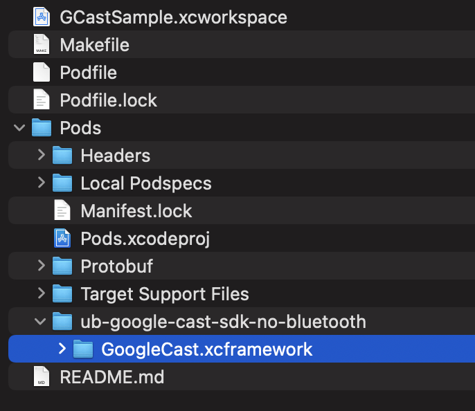

# Google Cast Bug

This project show the problem when install Google Cast dependency using Cocoapods.

## Podspec

https://github.com/ubook-editora/ub-google-cast-sdk-no-bluetooth/blob/main/ub-google-cast-sdk-no-bluetooth.podspec

## Problem

When install first time, the dependency folder is empty:

```
pod install
```


When install second time, the dependency folder is with correct content:

```
pod install
```



What is wrong with the Podspec?
